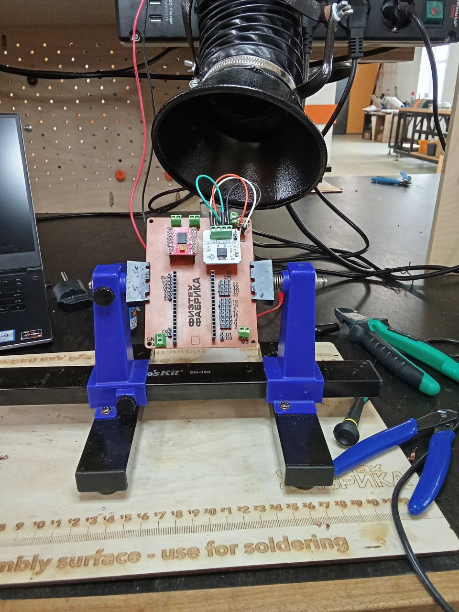
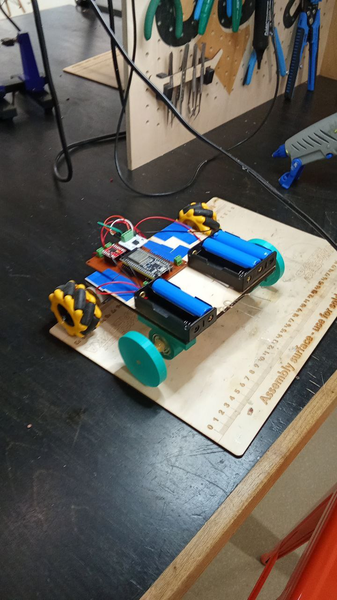

# Робот-машинка на ESP32

## 📋 Описание
WiFi-управляемый робот на ESP32 с:
- Драйвером двигателей TB6612FNG
- Адресной LED лентой (16 NeoPixel)
- Релейным модулем
- Адаптивным веб-интерфейсом

## 🛠️ Компоновка
| Компонент       | Характеристики                     |
|-----------------|-----------------------------------|
| Передние колеса | Mecanum (омни-колеса)             |
| Задние колеса   | 3D-печатные                       |
| Подшипники      | 6000 серии                        |
| Питание         | LiPo аккумулятор                  |

## 📷 Фотография проекта
- Изображение спаянной платы:

- Собранный робот:

